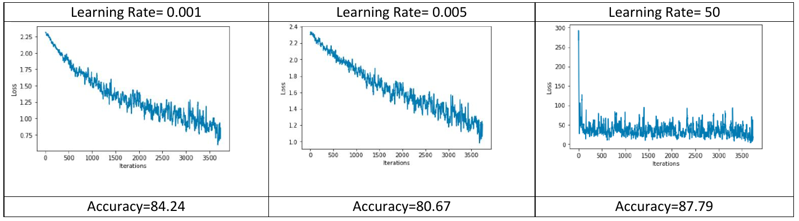
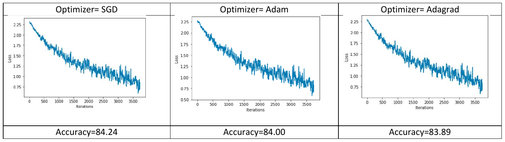
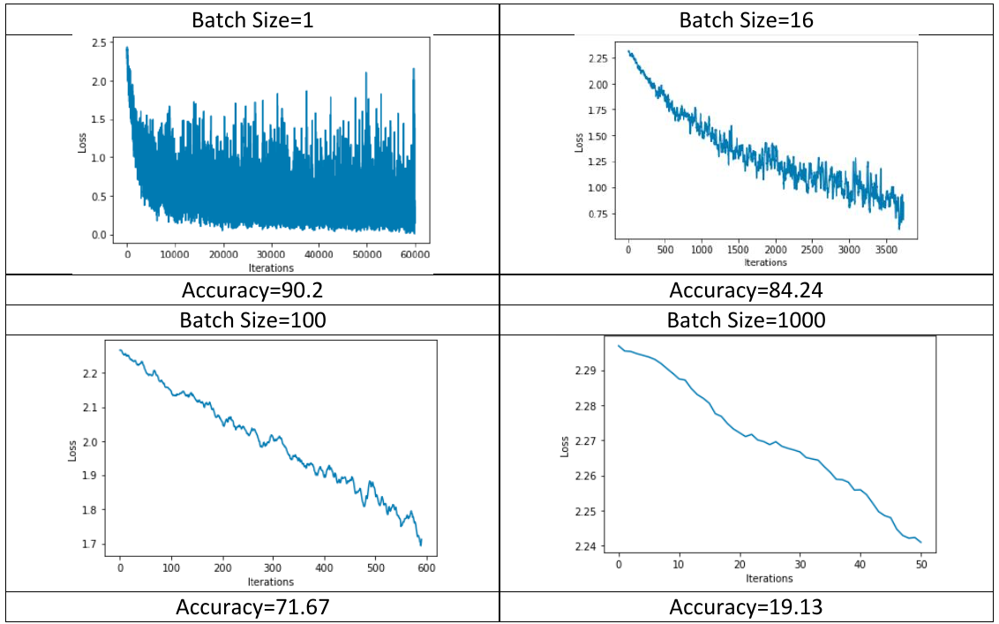
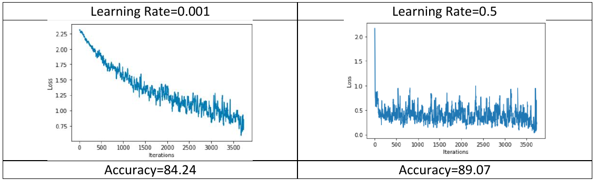
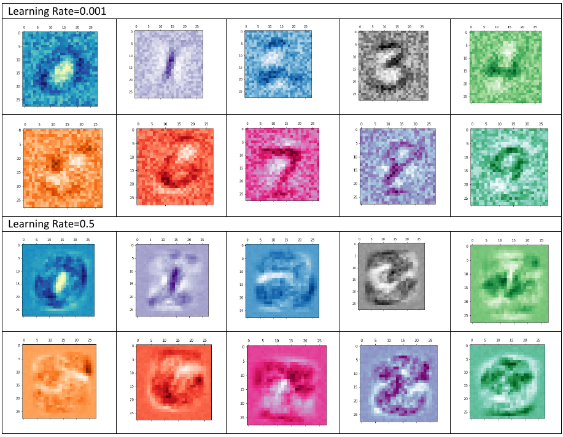

# Model-Improvement-Experiments

This repository showcases experiments for improving the performance of a neural network model using two notebooks: `OneLayerNetwork.ipynb` and `MoreLayerNetwork.ipynb`.

In `OneLayerNetwork.ipynb`, various changes are made to the model that initially achieves around 80% accuracy after 1 epoch. These changes include trying different learning rates (e.g., lower and higher values), experimenting with different optimizers (e.g., Adagrad or Adam), modifying the batch-size in the training dataloader, and visualizing weights for each class in a 28x28 resolution.

In `MoreLayerNetwork.ipynb`, the impact of adding more layers to the network is explored. Fully connected layers with "relu" activation are added, transforming the model into a 3-layer network with 500, 500, and 10 neurons, respectively. The goal is to achieve a test accuracy of over 95% within one epoch. The notebook provides flexibility in choosing batch size, optimizer, and learning rate to optimize the performance.

By exploring this repository, you can gain valuable insights into the effects of different modifications on model performance. Experiment with learning rates, optimizers, batch sizes, and layer configurations to enhance model accuracy and uncover the best settings for your specific use case.

# Tuning Parameters

## Learning Rate

Increasing the learning rate could not help converging the loss 0 as we see in the plot with
the learning rate=50. To compare the first two plots, we could look at the loss value. The model with
a learning rate=0.001 could reach a smaller value than the model with lr=0.005 which is
good for us. 

However, the computation time for the first model was bigger than the second model
although we could not mention it in the table. We can say that a small learning rate increases the
accuracy with small steps, but decreases the performance of the computationally.

Figure 1: Effects of the Learning Rate of the Model

## Optimizer

For one layer network, different optimizers do not introduce any differences:

Figure 2: Effects of the Optimizer of the Model

## Batch Size (Training Part)

To find the global minimum, we need to explore the surface of the feature space. Each training
data gives us information about the space. You can step into the space after acquiring one
piece of information or averaging much information. Batch size, somehow, corresponds to the number of data/information before taking a step. If the batch size is 1, the model has to move
around in the space more longer than others, which is obvious if we compare the number of
iterations of the models. This leads to requiring more time to train the model. If we analyze the
model whose batch size is 1000, it took more decisive steps but it has a long way to reach to the global minimum. So we need to find an optimum batch size for the model considering one epoch
size.

Figure 3: Effects of the Batch Size of the Model

## Weight Visualization

The two different cases are analyzed: learning rate with 0.00.1 and 0.5, in order to see the effect on the learning process.

Figure 4: Comparison of the Weights od the Model for Different Learning Rates-1

For one epoch, the second model learned well compare to the first model. We could see this result
in the table below: The weights of the model with a learning rate=0.001 are noisier. You could say that some values in the second model are not readable or understandable compare to the first model, such as 4. But we did not state that the second model has flawless. So this difference is not significant considering the whole model.

## Zero Initialization

Learning is happening with numbers: their values and their behavior make sense in the model. If
we initialize the whole weight and biases with zero, we simply state that “we don’t want to learn
anything!” This could be examined with loss function vs iteration graph and the accuracy of the
test data.

Figure 6: Effects of Zero Initialization